# MOCAP WRITEUP

## Week 1 - Planning & Script Writing

### Chosen Genre: Comedy

---

When it came to deciding what genre we wanted to do, comedy was a pretty much unanimous vote. Everyone pretty quickly decided that going for something that didn't take itself too seriously meant that we could get away with a lot more goofy and wacky antics in our shot and really play into the creative side of comedy with out of pocket jokes that would have the audience in tears after seeing our short film.

Looking through the different genres of comedy: Slapstick, Dark, Romantic, Satire, Parody, Mockumentry and various other genres we brainstormed a couple ideas that we wanted to pitch to the rest of the class to gain input on.

Our two most prominent ideas were 'Devil's Tango' a short where a man recieves a text from his partner expecting to do the devil's tango with her though upon entering their bedroom finds out he quite literally has to tango with the devil in order to win his partner's soul back. 

The other idea was 'Tech Bro and AI' about a Tech Bro who loved his AI a little too much and wanted to pitch its revolutionary idea to his boss to sell as a commercial product. With the twist that the AI is entirely incompetent and is incapable of doing anything the user asks.

After pitching to the class and gaining some feedback on our ideas we ultimately decided to go with tech bro vs AI. 

### Research

---

After deciding on what kind of short film we would be doing it was time to do a bit of research into similar esq shorts to try and identify what made them humourous and what worked for their comedy.

**EXAMPLE ONE: MEET THE SCOUT**

https://youtu.be/geNMz0J9TEQ?si=ECTbiHXNgjUebz95

'Meet the Scout' is a video in Valve's 'Meet The ...' series used to promote characters for the game Team Fortress 2 and often showcase the personality of the character in a really short video. Scout being one of the more comedic characters in the aforementioned game was a good reference point to use for a short skit-like video utilising solely video game animation. The short in its 1 minute 30 runtime effectively establishes its titular character 'The Scout' alongside some of the more slapstick comedy aspects of his personality and in-game traits that would make him be so loveable by fans.

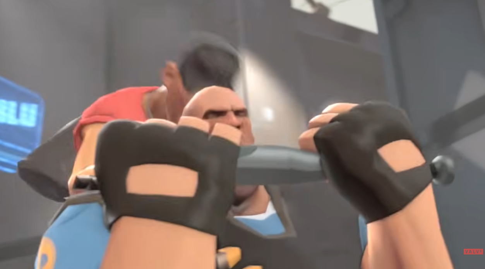

I felt like what made 'Meet the Scout' so effective was its use of constant switching cameras which didn't particularly linger on any one shot for too long without immediately cutting to something else to effectively pull off quick jokes. This almost 'rapid-fire' style of comedy exemplified in this video also allowed for jokes to linger a bit longer whilst still introducing the audience to more jokes which ultimately creates this cohesive story telling method that doesn't overstay its welcome. 

I think that I will attempt to adapt elements of this into my own personal rendition of the cutscene we end up making as something like this video is completely in line with what my group and I have discussed we would like to do for the project.

**EXAMPLE TWO: THE DISASTROUS LIFE OF SAIKI K**

https://youtu.be/c0qkm0x_ae4?si=PHOh7JBXGn3mPLwA

'The Disastrous life of Saiki K' (often shortened to just Saiki K) is a comedy anime that hails from the gag comedy and satire comedy subgenres and uses it to its advantage to create incredibly memorable moments and jokes throughout its two season runtime. With the centre of our idea being about mocking a stereotypical 'Techbro' I felt like Saiki K would provide a perfect reference point when it pertained to seeing how they handled their satire and parody comedy aspects in order to take into account things I could do for my cutscene.

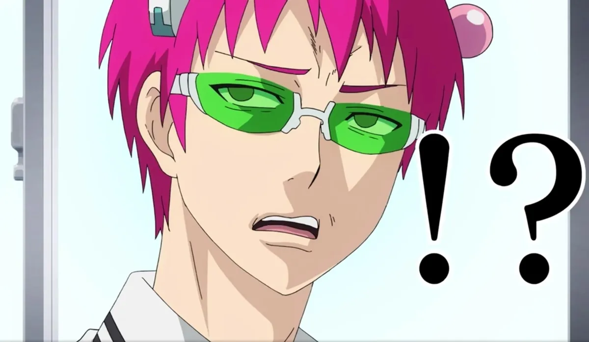

Most of what I gathered from watching a few Saiki K clips in order to garner information on how to create an effective comedy skit is that often playing into a character's stereotypical traits can lead to humour on the end of the audience if you mock preestablished traits that an archetype is known for. Doing that for something like a Techbro would be incredibly easy and with much of the younger generation often hating AI and its implications on the world creating a scenario where the Techbro is humilated and looked down on as a bit of a loser to play into the stereotype that most people of my generation hold about people who excessively obsessed with AI.

**EXAMPLE THREE: The Stanley Parable**

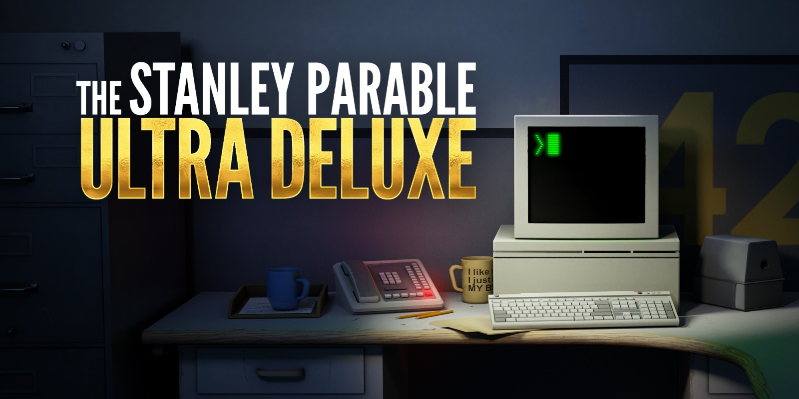

https://youtu.be/IT4oxVX5ewU?si=uO73-9c3rWKtIGnC

Whilst not your conventional comedy, 'The Stanley Parable' has cemented itself in internet culture as being a hilariously sad game, with its twist ending and general darker undertones, it is often overlooked just how well the comedy of this game is written to support the contrast of the twist endings and the general surface level story that's being told to the player upon first time playthroughs.

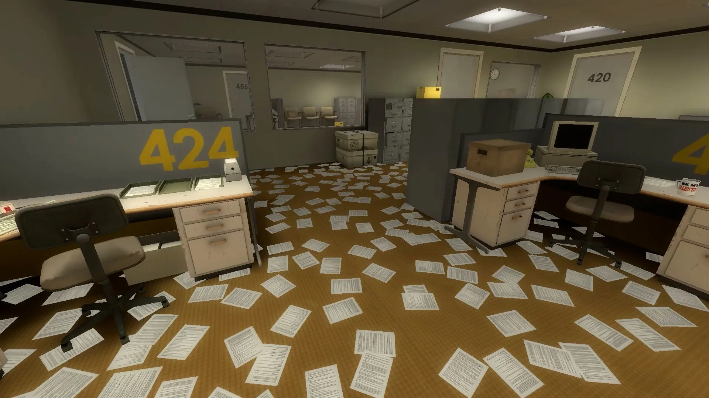

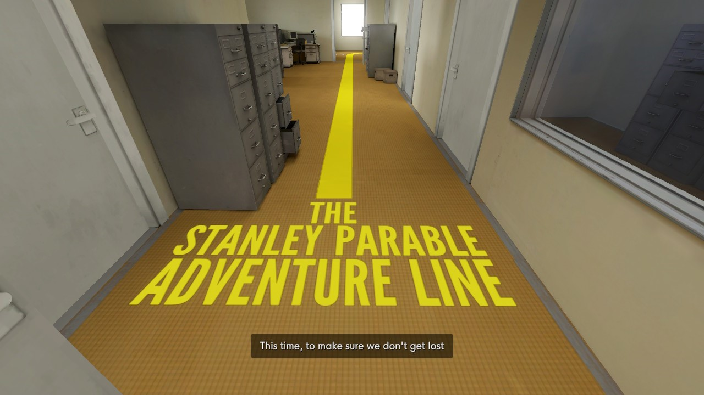

Stanley Parable pulls from the meta-comedy and dark humour subgenres to create what is an incredibly memorable experience for anyone playing blind. It uses a large series of incredibly blunt and obvious story telling to create an almost comedic undertone which has the player chuckling at the almost obvious nature of a lot of the jokes in the game. It perfectly matches the mundane and dread of the setting of the game, being an office building, as the main character, Stanley, navigates this story setup by the disembodied narrator.

Stanley Parable has a lot to take away from in terms of how I can use it to further my own cutscene, with its office setting and blunt joke telling being core aspects of its comedy and also fitting into my cutscene's setting of a work environment too. It might be great to have supporting characters in the cutscene showcasing almost dread and blunt tiredness to contrast the techbro's almost upbeat and child-like excited nature of his AI. 

### Script Writing

---

Before concluding our activities we eventually decided to get a basic script down and work on our shotlist document to pretty clearly plan out what the cutscene would look like and what we would need to record for our motion capture in the second week. 

https://ucreative-my.sharepoint.com/:w:/r/personal/2310895_students_ucreative_ac_uk/_layouts/15/Doc.aspx?sourcedoc=%7BE856EF1D-0E62-446B-A1A2-E40003BFF8AD%7D&file=GLEM%20Shotlist.docx&fromShare=true&action=default&mobileredirect=true

Attached above is a copy of our shotlist for our group cutscene and although I generally liked the idea, I wanted to personally move away from the commercial aspect and play more into the 'pitch gone wrong' idea that was its core rather than having it be a commercial. 

As a group we all carefully planned out what would happen in each scene in order to get the best results and a product we were happy with.

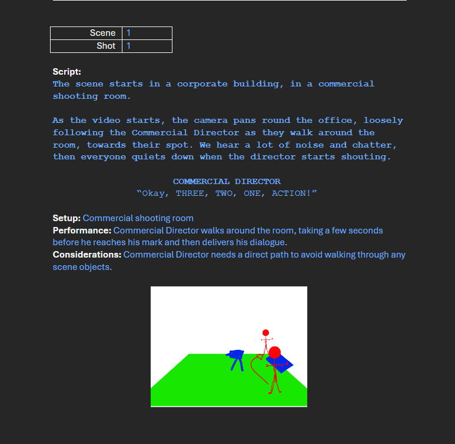

*Figure 1. The first part of the script written down in the shotlist. We immediately got to planning out each scene and shot along with the script in order to avoid confusion later from just writing out dialogue*

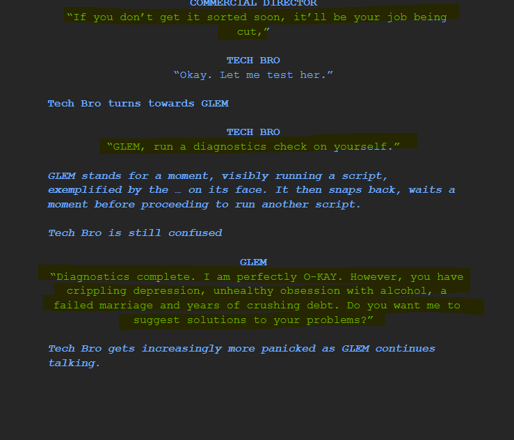

*Figure 2. Highlighted dialogue that I personally wrote for the script.*

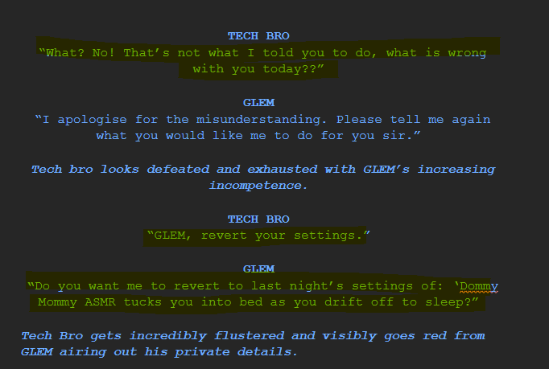

*Figure 3. An extension of figure 2 showcasing dialogue I had contributed. My direction with these kinds of jokes was to emulate a style seen in Saiki K using that parody and stereotype comedy in order to poke fun at a lot of Tech bros being lonely and using AI to supplement real human connection, whilst using a bit of a crude reference in order to catch viewers off guard and hopefully get a laugh out of them.*

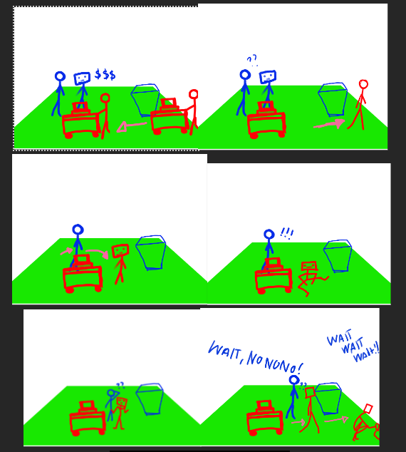

*Figure's 4-6. A look at some shot breakdowns for scenes I ended up using in my personal rendition of the cutscene as I cut shots 5 and 6 out of my cutscene due to time contraints. The shot breakdown clearly illustrates the actions that would be taking place and the general position of all the characters on screen at any given moment. I took some liberities with this dude to my set piece and the positioning of my camera. I will talk about this a bit later in the dev journal.*

## Week 2 - Motion Capturing! 

Unfortunately due to an unforseen A&E visit I was unable to actually attend the shoot day and thus am only able to comment on pictures I was sent of the shoot day and will have to use second hand accounts of the day in order to annotate the following section.

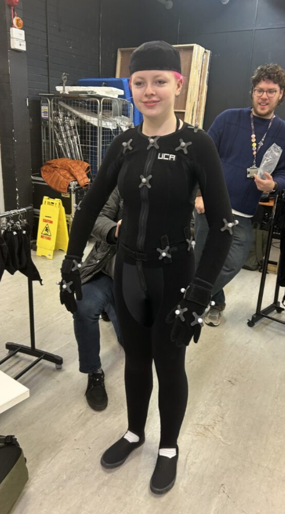

*Figure 7. One of our actors getting into the motion capture suit and getting ready to film the scene! From what I was told the setup didn't take as long as the group had expected and allowed them more time to actually film what they needed to for the cutscene.*

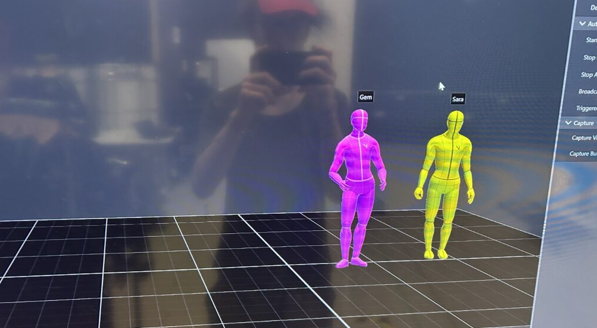

*Figure 8. Showcasing the in engine look at the two motion capture actors in scene and the software properly picking them up and ensuring that everything is working as intended!*

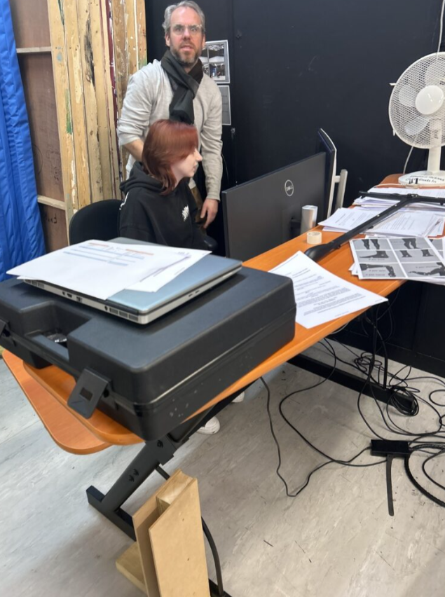

*Figure 9. Gavin assisting with some issues on the software, I was told this was resolved pretty quickly and was just a marker error or something, I cannot quite remember sadly!*

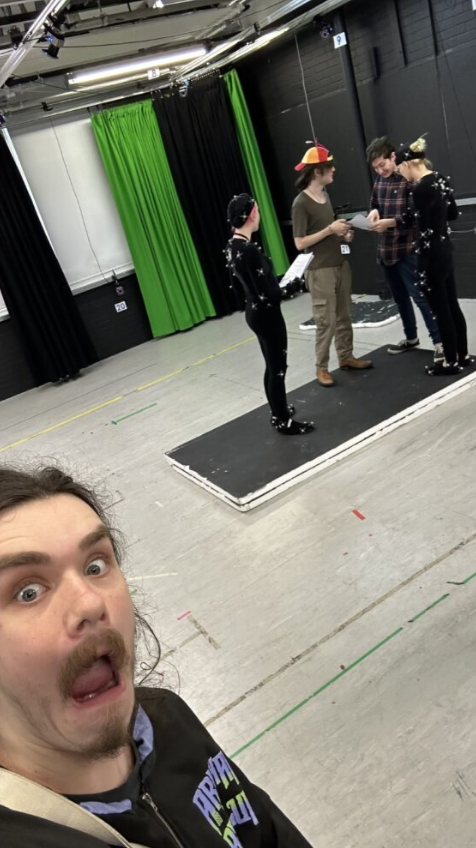

*Figure 10. Max posed up funnily as the group go over the shot directions in order to get ready for the next take*

*Figure 11. The whole group selfie (minus me) after doing various shots and takes. I believe this was just as they were about to take a lunch break if I remember correctly*

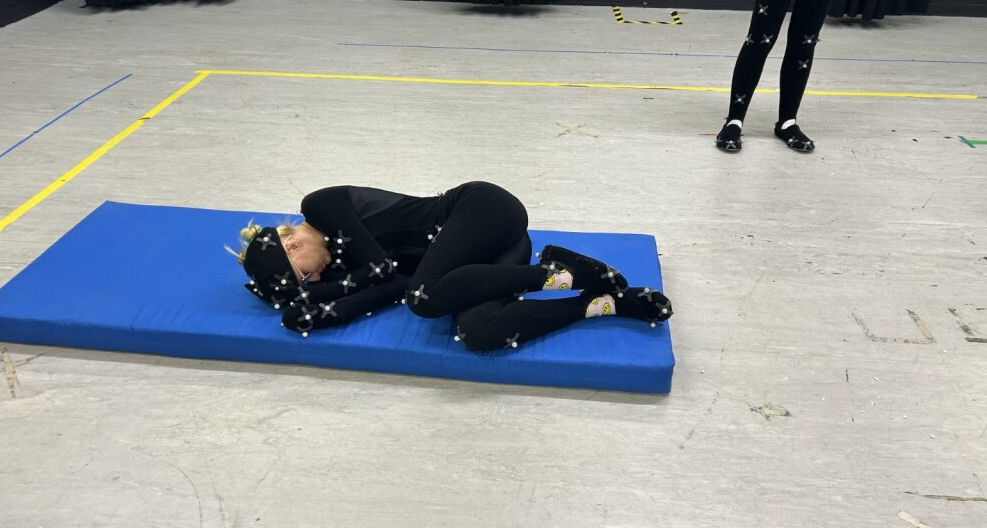

*Figure 12. Filming the Tech Bro fight scene and having to use the padded mats to ensure no injuries were occuring on site! Safety is very important!*

---

### Afterthoughts of Week 2

As I couldn't attend the shoot I unfortunately don't have much to comment on what happened that day however from pictures and accounts I was given for the most part filming went smoothly with setup not taking too long and many of the shots not requiring more than one or two takes with a few errors here and there. For the most part everyone found it a pretty positive experience with a lot of fun takeaways and learning lessons with the mocap suits that made it memorable for everyone.

## Week 3 - Motionbuilder and importing into Unreal

Once again I was still dealing with the aftermath of my A&E visit and was only on campus for one day to attend the motionbuilder class so I won't have much to say in this section as I was only able to work for a day during this week.

Week 3 mostly consisted of getting the hang of Motion Builder and importing all my animations into Unreal so I had everything ready to go before starting Week 4 and actually building the cutscene. As I didn't have any models or assets selected at this time I wasn't actually retargeting any animations at this point but rather just bringing all the FBX files into unreal.

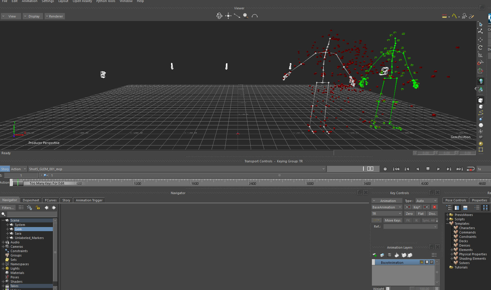

*Figure 13. A look at selecting branches in Motionbuilder in order to save and port the animation sequence into unreal. I had already by this point set up a cube on a prior FBX mocap file so I was only selecting the markers here to bring into Unreal.*

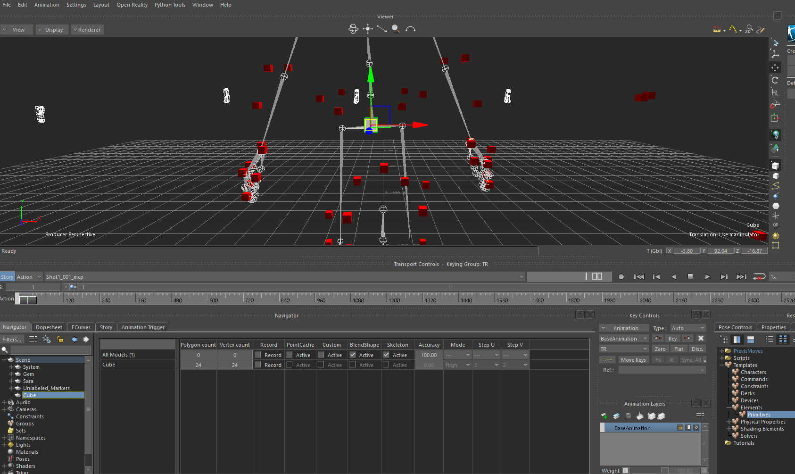

*Figure 14. Attaching a cube to the hips for the first export in order to allow all future exports to be targeted to one skeleton.*

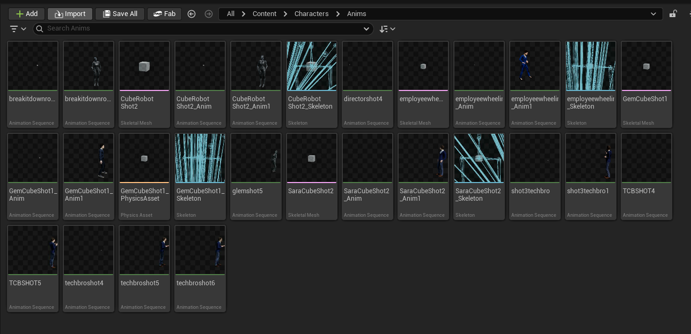

*Figure 15. All exported skeletons + animation sequences that I had brought on over from motionbuilder. Most of these gave me no issues though I would later come to find that things like the transform were all over the place for these but as for importing I had no issues.*

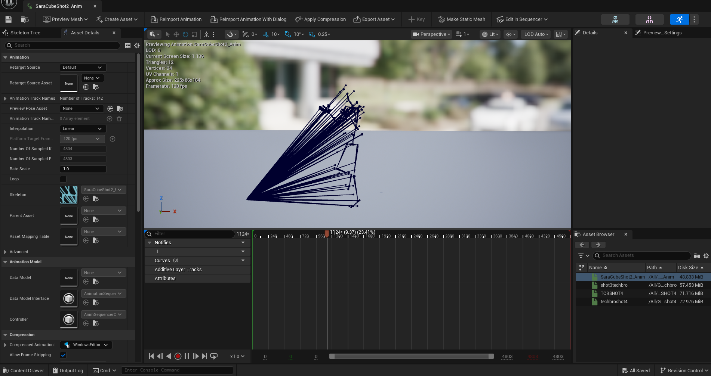

*Figure 16. I spent most the day in motionbuilder after class just fiddling around with stuff to ensure that all my exports were correct and showing up as they should in unreal, I checked in the viewports with heirarchy view set to all in order to see the skeletons. The large amount of lines are just due to the unmarked markers I left on the body which I didn't delete in motionbuilder. It makes a bit harder to view the animations though unreal ignored them in engine so to go and delete it for every export felt like unworthy hassle.*

Most of week 3 was spent on this day just bringing everything into unreal in order to be able to pickup where I left off in unreal with everything already in there so I could just find assets and set dress then get to sorting out everything in the sequencer. I think motionbuilder was probably the biggest hurdle for me this week due to the fact I had never used it whereas with everything else I have been loosely familiar with or have used it. This made for a fun challange just getting used to navigating through motionbuilder and exporting fbx files but in the end it turned out alright and I didn't have any major issues.

## Week 4 - Putting it all together

Going into Week 4 I had one sole objective of ensuring that I had a 1 minute 30 cutscene and a well dressed scene in order to have something to turn in as I was falling a bit behind where I had been unable to work during Week's 2 and 3.

I first got to finding assets.

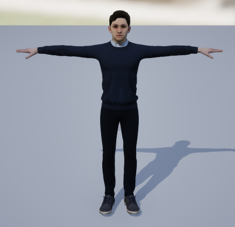

*Figure 17. A look at the model I pulled from Mixamo in order to use as my director character. As the cutscene (at least in my head) had this like workplace office environment going on I wanted it to feel more like a sales pitch from an employee to a boss so I wanted to find a model that fit the vibe of smart casual and I feel like this model worked pretty well. Being a mixamo model it meant that it was already rigged and ready to use with motion capture so I had no issues with the model and retargeting animations.*

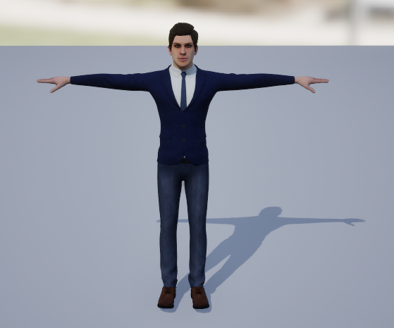

*Figure 18. Fitting with the smart casual and buisness environment I was going for, I picked this model for the main 'Techbro' as I felt like as an employee he would have stricter dresscode and need to appear more formal due to him providing a pitch to a higher up, hence the suit and tie with jeans. I feel like his model worked appropriately well for what I was going for in this situation.*

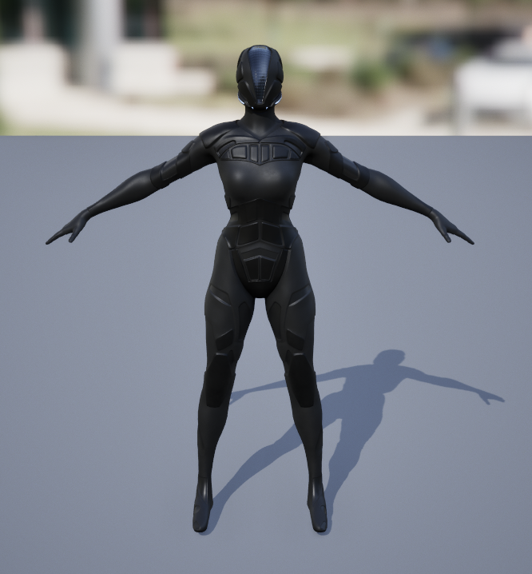

*Figure 19. When it came to the 'GLEM' ai I wanted to pick something that felt like it was excessively futuristic, almost like if the tech bro had designed it specifically to look cool and impress people, hence the choice of incredibly futuristic sleek carbon design on the AI model. I was incredibly limited in my choices for models in this specific category and I wish I had the 3D modelling skills to actually make my own, however this was the best I could find and I feel like, though not entirely spot on with what I wanted, it mostly matched the vibe I was going for!*

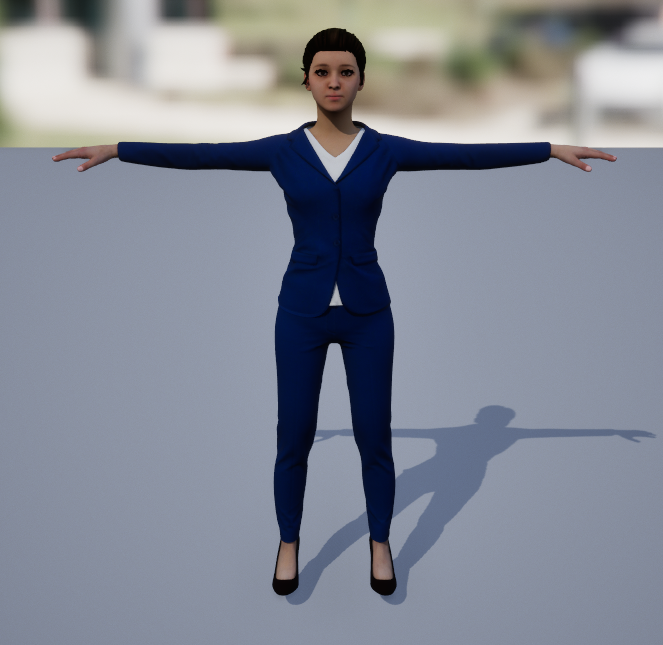

*Figure 20. This was just another work place model I picked just to match the vibe of what was already going on with the environment. She only appears in one shot so I didn't particularly care for the design, especially as she had no lines in the script either.*

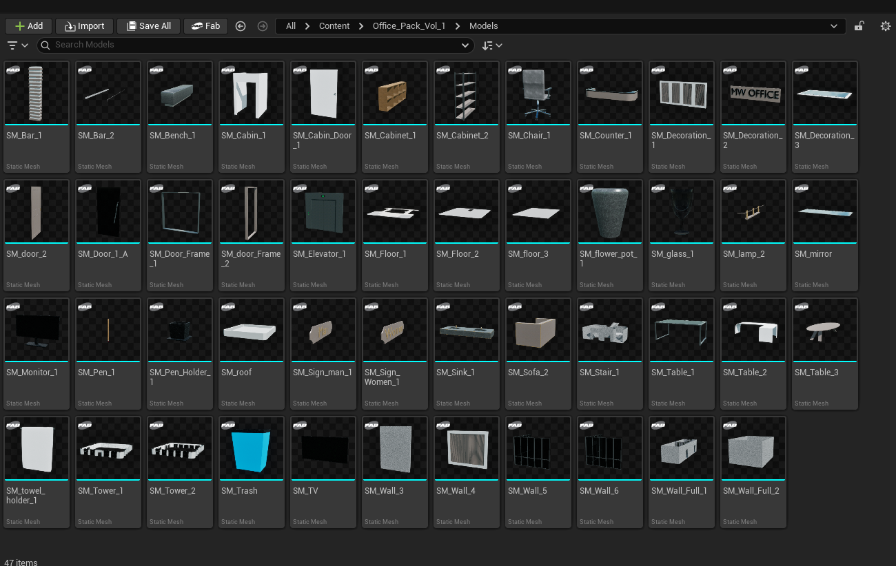

*Figure 21. When it came to the actual environment I found a modular workplace pack on fab for free which I was able to download and utilise the assets. The vibe mostly matched the idea I had going on as I was pivoting away from my group's general idea of a commercial and more into the idea of a pitch I wanted it to not be a TV set but rather just a workplace environment like how you would pitch to a boss in any other regular environment. This is just a picture of all the assets that came in that modular pack.*

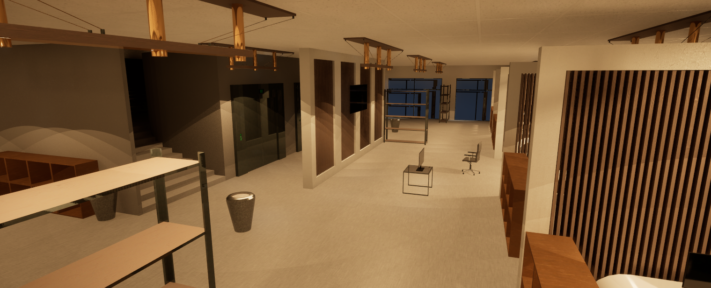

*Figure 22. A look at the set dressed office space that the cutscene would take place in from the starting perspective of the camera in the actual cutscene.*

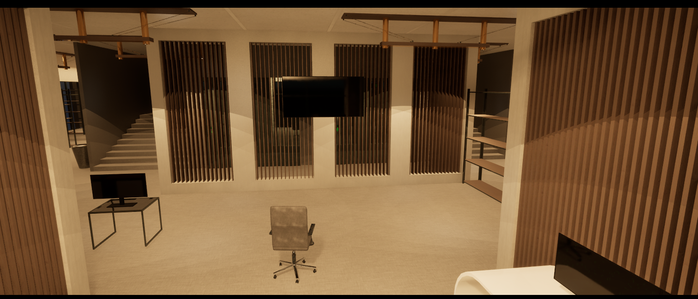
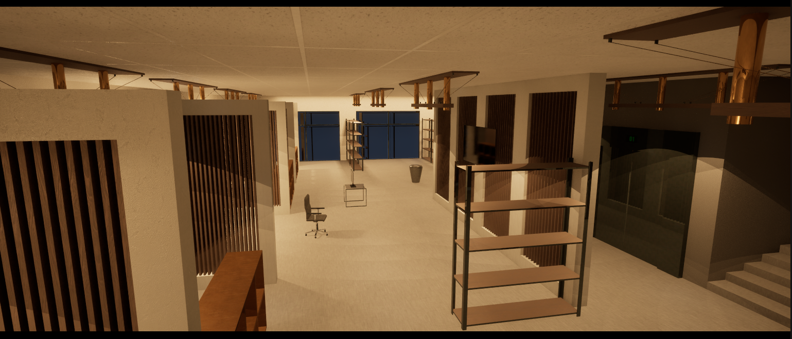
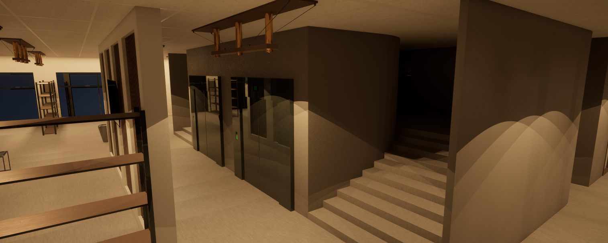

*Figure 23-25. Some additional angles of the main area where the entire cutscene takes place. I feel like the entire look and feel of the building gave off that very corperate vibe and when I showed it off to some friends too for some feedback on my choice of set they gave me the same comments that it definitely looked and felt like an office building.*

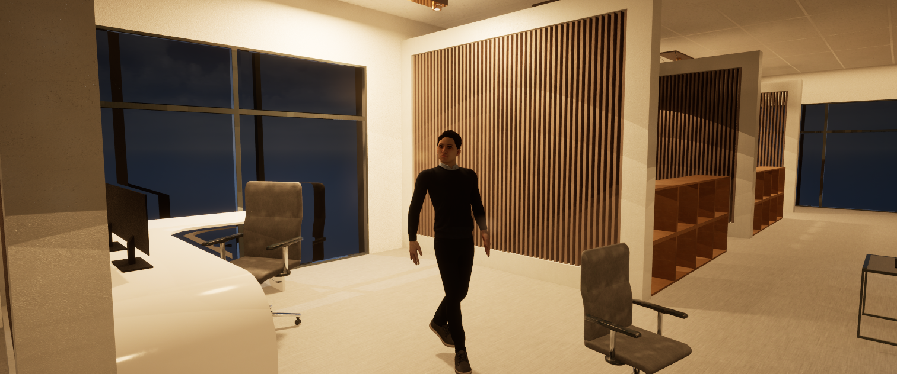
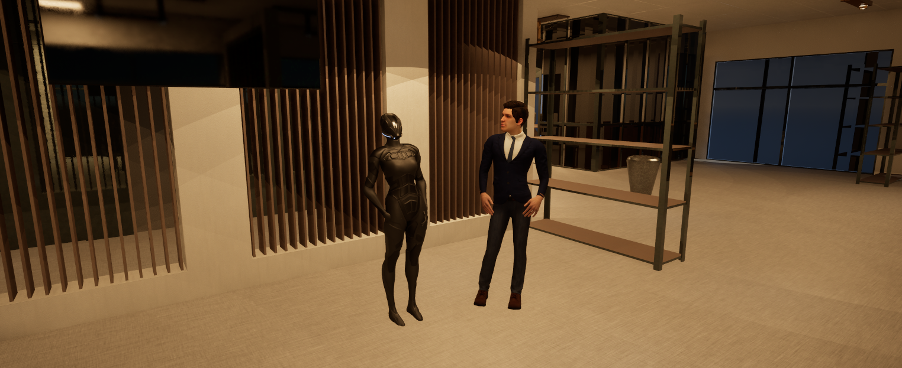
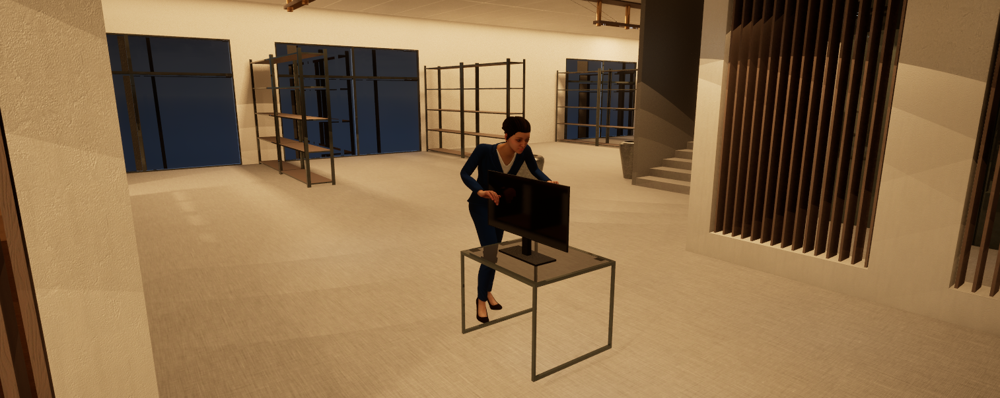

*Figure 26-28. A look at the scene during the cutscene not using the main sequencer's camera but instead taken behind the scenes just to provide some alternative looks at the scene with all actors in it during motion. Looking behind the scenes I think theres definitely a few aspects of the scene that look a bit 'jank' for lack of better words but during the actual camera cut camera in the sequencer I think they came out fine.*

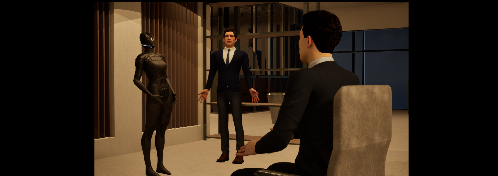
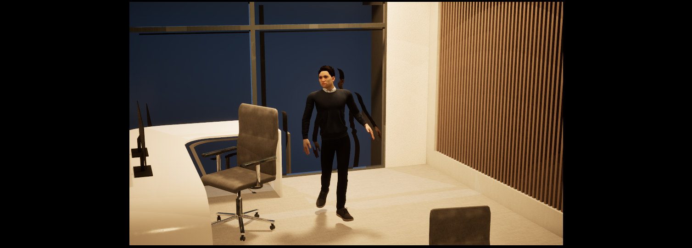
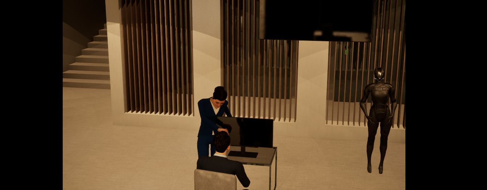

*Figure 29-31. A look at the scene and actors during the actual sequencer's camera this time. I think definitely looking at this scene through the camera I'm super happy with how it turned out. I think that my research into and prior knowledge of cinematography techniques really helped amplify my camera perspectives for what is otherwise a pretty motionless cutscene where two characters are just talking. I'm a big fan of the framing on figure 29 and is definitely one of my favourite shots from the project.*

*Figure 32. I was incredibly happy with this wipe shot that lead into framing the main two characters of the next shot. I think it works way better than just having it slightly pan over to reframe the shot but rather uses something more dynamic and allows a better feel for the surroundings whilst acting like a seamless transition between the director and the employee, creating some much needed seperation between the two, emphasising their difference in importance.*

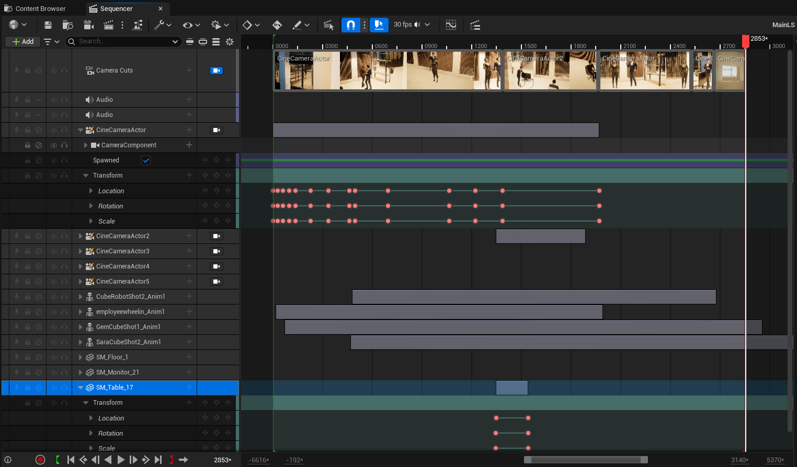

*Figure 33. A look at my sequencer from the final cut with all the actors and different transforms that were pulled off to make the cutscene. I think in general just working and playing around with the camera and different shots was my favourite part of this, I enjoyed being able to have a lot more logical freedom with the camera than you otherwise would with a traditional film camera and it allowed for some more dynamic shots and framing throughout the duration of the cutscene which I was really happy with. It was a shame that the animations kept messing up at points which led to less than favourable shots but I believe I fixed everything in time for the final cutscene.*

### Sound and Audio (last little bit)

So I didn't do the sound or audio in unreal because I found unreal's sequencer and audio handling incredibly frustrating to work with so I swapped over to davinci resolve which is something I am much more familiar with in order to add in all the foley and voicelines we recorded.

I sweeped through pixabay for all of my sound effects that I used for foley as I was unable to record my own foley.

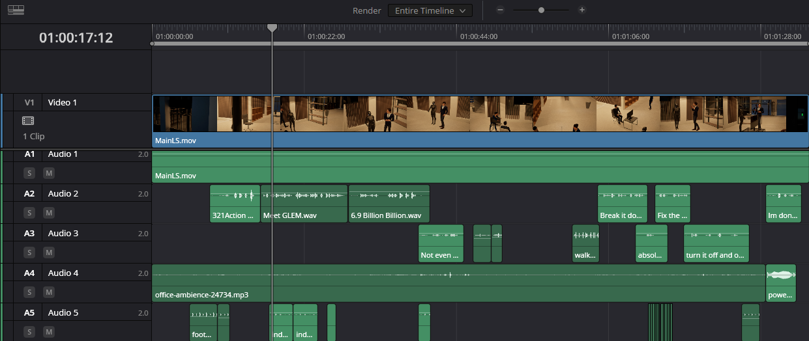

*Figure 34. My davinci resolve timeline after adding in all voice lines and foley alongside tweaking audio in order to ensure none of it was too loud or too quiet and it all fit in with what was going on with the scene. This part was pretty short due to the general atmosphere of the scene only really requiring walking sounds and general office noise as to not make it feel like dead air with conversation during the entire cutscene.*

---

## Final Thoughts

Just to close out with some of my final thoughts I think this project was definitely an interesting one. It was a shame I missed half the weeks and thus missed out on a lot of opportunities like the mocap filming day and just time I could've used to better prepare my cutscene and myself. If I could make any adjustments in hindsight I probably would've campaigned harder to do my idea of 'Devil's Tango' that I mentioned earlier. I think a lot of my problems with this cutscene and idea was that the joke got pretty old pretty quick and felt like it dragged on which was part of my reason for cutting down the full cutscene to be shorter. I also feel like the general lack of motion and just general concept really limited what could've been possible as there were only so many possibilities what you could do with two characters having a conversation that isn't just switching angles so the viewer isn't just staring at a static cutscene for half the time. That being said I definitely think with a bit more time I would've been able to maybe better flesh out some ideas for this cutscene and maybe integrate a bit more of the script into it to maybe create a longer scene though due to a lot of issues with later mocap fbx files like the transform being off or just general unclear labelling I found it difficult to work with the latter half of the mocap files too. 

Here is also the cutscene uploaded privately to youtube.

<iframe width="560" height="315" src="https://www.youtube.com/embed/y0nYS57H0Is?si=a-MPaY5VzfoYFjqX" title="YouTube video player" frameborder="0" allow="accelerometer; autoplay; clipboard-write; encrypted-media; gyroscope; picture-in-picture; web-share" referrerpolicy="strict-origin-when-cross-origin" allowfullscreen></iframe>

(link if the embed doesnt work since i dont remember if embeds work in markdown)

https://youtu.be/y0nYS57H0Is